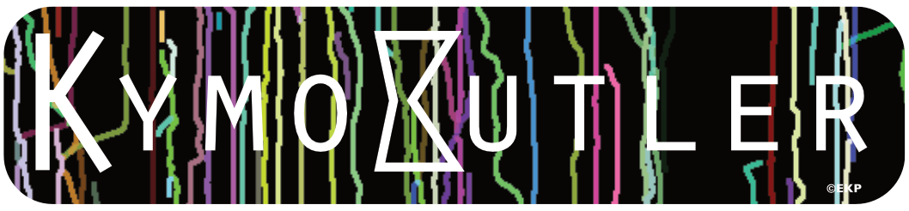

# KymoButler

Deep learning for automated kymograph analysis. KymoButler segments and tracks particles in kymographs (space-time images from live microscopy), supporting both bidirectional and unidirectional transport.

## Installation

```bash
git clone https://github.com/MaxJakobs/KymoButler.git
cd KymoButler
pip install -e .
```

Model weights are included via Git LFS and downloaded automatically on clone. If you see small pointer files instead of model weights, run:

```bash
git lfs pull
```

## Quick Start

### Python API

```python
from kymobutler.models.weights import load_default_models
from kymobutler.segmentation import segment_bidirectional
from kymobutler.tracking import track_bidirectional
from kymobutler.postprocessing import postprocess

models = load_default_models()
was_negated, raw, preprocessed, prediction = segment_bidirectional(
    "kymograph.png", models["binet"]
)
tracks = track_bidirectional(
    prediction, preprocessed, was_negated, vision_net=models["decnet"]
)
stats = postprocess(tracks, pixel_time=0.5, pixel_space=0.1)
```

### CLI

```bash
# Bidirectional analysis
kymobutler analyze --mode bidirectional kymograph.png

# Unidirectional analysis
kymobutler analyze --mode unidirectional kymograph.png

# With custom parameters
kymobutler analyze --mode bidirectional --threshold 0.2 --min-size 10 --min-frames 10 -o results/ kymograph.png
```

Outputs: track coordinates (CSV/JSON), statistics (CSV), and an overlay visualization (PNG).

## Models

Four neural networks are included in `models/` (tracked by Git LFS):

| Model | File | Purpose |
|-------|------|---------|
| BiNet | `bidirectional_seg.onnx` | Bidirectional segmentation |
| UniNet | `unidirectional_seg.onnx` | Unidirectional segmentation (ant/ret) |
| DecNet | `decision_module.onnx` | Vision module for track disambiguation |
| ClassNet | `classifier.onnx` | Track classification |

Models are loaded from `models/` in the repo, or `~/.kymobutler/models/` as fallback.

To convert ONNX to PyTorch state dicts (optional, for faster loading):

```bash
pip install -e ".[convert]"
python scripts/convert_weights.py
```

## Testing

```bash
pip install -e ".[dev]"
pytest
```

## Legacy Mathematica Implementation

The original Mathematica implementation is in `legacy/`. See [legacy/README.md](legacy/README.md) for details.

## References

If you use KymoButler, please cite:

Jakobs, Franze & Bhatt (2019). KymoButler, a deep learning software for automated kymograph analysis. *eLife* 8:e42024.

## License

MIT
